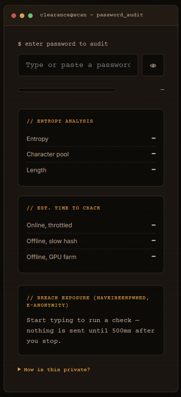
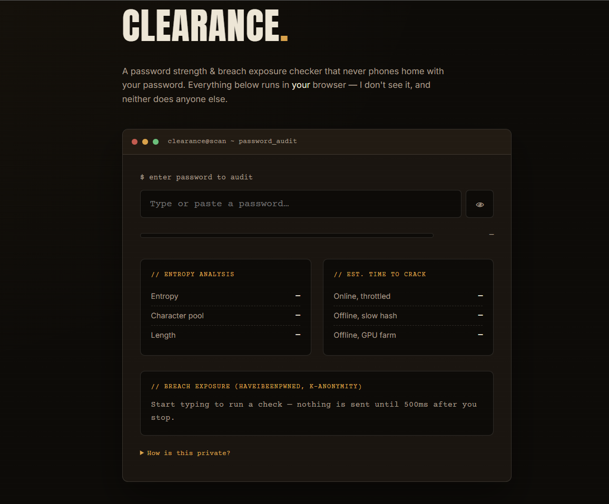

# 🔐 Clearance — Password Strength & Breach Checker

A password strength and breach-exposure checker that runs **entirely in the browser**.
No backend, no password ever transmitted in plaintext, no tracking.

**[Live Demo →]([https://whyonlythakur.github.io/password-breach-checker/](https://whyonlythakur.github.io/Clearance/))** 




---

## Why I built this

Interning with the Haryana Police Cyber Cell (CyberCrime ACP Office) put me face to face
with how often "strong-looking" passwords turn out to already be sitting in public breach
dumps. Most password strength meters only check character variety — they don't tell you
whether the password has *actually* been leaked. This tool does both, without ever asking
you to trust a server with your real password.

## Features

- **Entropy analysis** — calculates bits of entropy from character pool + length, not just a naive regex check
- **Realistic crack-time estimates** — three attack scenarios (throttled online guessing, offline slow-hash cracking, offline GPU-farm cracking)
- **Breach exposure check** — queries the [HaveIBeenPwned Pwned Passwords API](https://haveibeenpwned.com/Passwords) using the **k-anonymity model**: only the first 5 characters of a locally-computed SHA-1 hash are ever sent over the network. The full password and full hash never leave your device.
- **Zero dependencies** — vanilla HTML/CSS/JS, no build step, no framework

## How the privacy model works

1. Your password is hashed locally in-browser with `crypto.subtle.digest('SHA-1', ...)`
2. Only the **first 5 hex characters** of that hash are sent to the HIBP API
3. HIBP returns *every* breached hash suffix starting with those 5 characters (typically hundreds to thousands of candidates)
4. The match against your full hash happens **locally**, in your browser

This is the same anonymity model used by Chrome's password checkup, Firefox Monitor,
and 1Password's Watchtower. [Cloudflare has a good writeup on the math behind it.](https://blog.cloudflare.com/validating-leaked-passwords-with-k-anonymity/)

## Tech stack

- HTML / CSS / vanilla JavaScript (no framework, no build tooling)
- Web Crypto API (`SubtleCrypto`) for local SHA-1 hashing
- [HaveIBeenPwned Pwned Passwords API](https://haveibeenpwned.com/API/v3#PwnedPasswords) (free, no key required)

## Run it locally

No build step needed — it's static files.

```bash
git clone https://github.com/whyonlythakur/password-breach-checker.git
cd password-breach-checker
# open index.html directly, or serve it:
python3 -m http.server 8000
# visit http://localhost:8000
```

## Deploying to GitHub Pages (so it's live)

1. Push this repo to GitHub (repo name suggestion: `password-breach-checker`)
2. On GitHub, go to **Settings → Pages**
3. Under **Build and deployment → Source**, select **Deploy from a branch**
4. Branch: `main`, folder: `/ (root)` → **Save**
5. Wait ~1 minute, then your live URL will appear at the top of that Pages settings screen:
   `https://<your-username>.github.io/password-breach-checker/`
6. Update the "Live Demo" link at the top of this README with that URL

That's it — no server, no environment variables, no cost.

## Roadmap / ideas for later

- [ ] Add zxcvbn-style pattern detection (dictionary words, keyboard walks, common substitutions)
- [ ] Passphrase generator with the same entropy readout
- [ ] Dark/light theme toggle

---

Built by [Arpit Singh](https://thakur.snapz.dev) — part of an ongoing series of small, real security
tools built out of the cybersecurity Internship Under Haryana Police Gurugram Cyber Cell.
